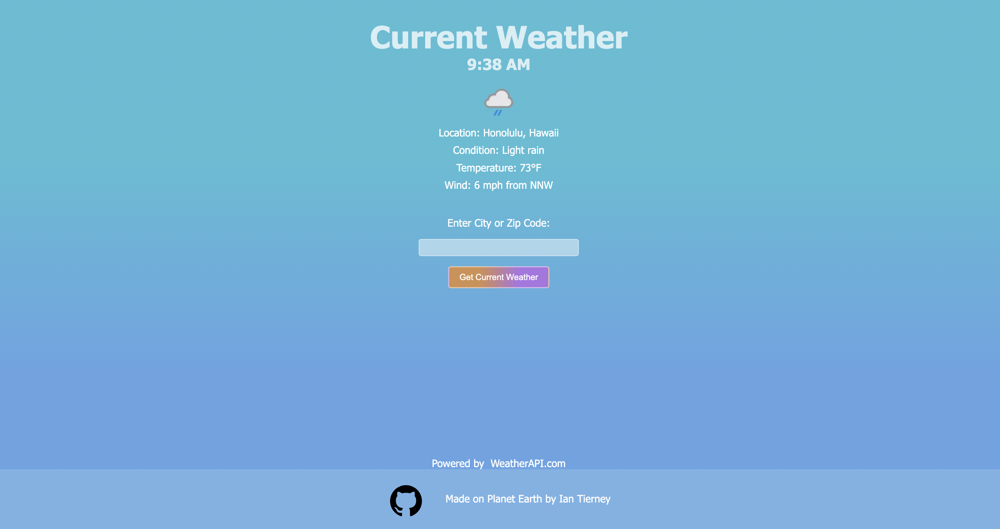
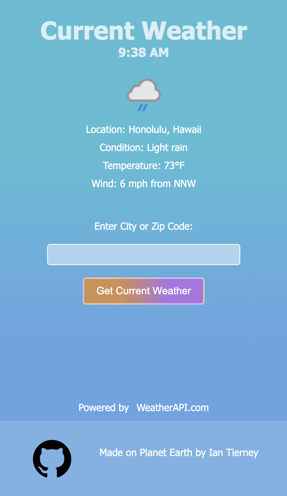

## Weather App Project
What a lovely way to check out the weather. This project allows the user to input a city or zip code and returns the current weather conditions. On the backend this was the first time using promises, async, await, fetch, and APIs. 

### Screenshot of desktop view

### Screenshot of mobile view

